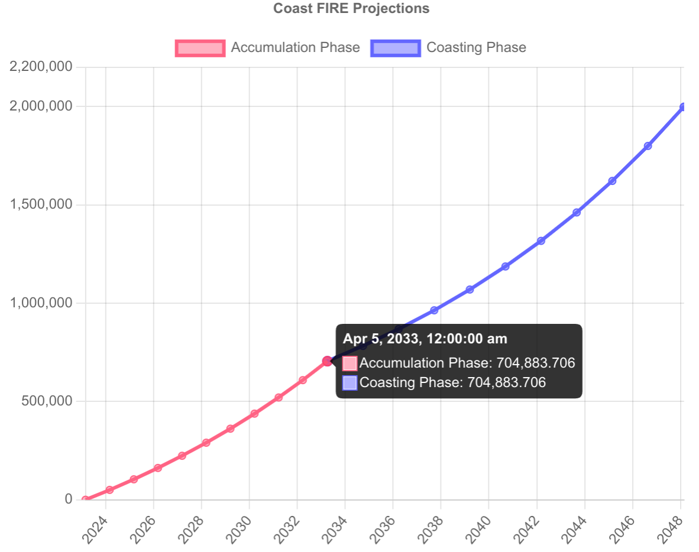

# coast-fire-calculator

> :point_right: **Go [here](https://bradybolton.github.io/coast-fire-calculator/) to play with the actual calculator**

I wanted a graph-focused FIRE calculator:
* Show me FIRE, coast-FIRE, barista-FIRE, lean-FIRE, and even "die with zero" scenarios
* Slap a slider on (almost) every input

The app was originally called `coast-fire-calculator`, but after playing with the tool I've found the path to FIRE to be extremely flexible.

### How it works

The X axis is time. The Y axis is your net-worth. The graph goes up from left to right, hopefully. (It doesn't always have to be!)

Graph could have a pink line, a blue line, or both. They represent 2 periods in your life:
* Pink: you're saving money (saving $X in "Contributions (monthly)")
* Blue: you're saving $X monthly in "Barista FIRE Contributions (monthly)"
    - could be zero, something small, or negative (you're withdrawing money)
* Beyond: your retirement



In this example, I'm 35 starting from nothing, looking to retire at 60, setting aside $4000 a month toward a goal of $2m (to sustain a 4% withdrawal rate of $80k/yr) given that we see an average rate of turn of 7%. I would need to keep it up until I accumulate around $705K in investments by the time I turn 45 (so ~10 years). After my 45th birthday, I will halt all retirement contributions with the expectation that my nest-egg will grow by $1.3m by the time I turn 60. By then, I believe that $6666/mo (potentially more due to SS) will allow me to live comfortable for the rest of my life.

Depending on your situation, either of the following could be true:

* You don't need to save any money (already coast FIREd)
    * A blue line that blows past your FIRE number
* You're saving money for only a few years
    * Red and blue lines that eventually hit your FIRE number
* You're saving money up until the day you retire:
    * Red line only (blue line is infinitesimal) that hits your FIRE number
* Your retirement goal is unrealistic and you will fall short of that goal
    * Just a red line that never hits your FIRE number

Also check out [this resource](https://walletburst.com/tools/). You might even want to "retire" with $0 (or very little)! See ["Die with Zero"](https://www.diewithzerobook.com/welcome). I think the coast FIRE strategy is a pragmatic balance that lets you turn the "boring middle" into an "exciting middle" sooner.

## To run

Run this by:

```
npm i
npm run dev
```

Then open [http://localhost:5173](http://localhost:5173) to view it in the browser.

Run basic tests to verify coast fire calculations:

```
npm run test
```

## Motivation

My main motivation is to show the power of investing in your 20/30s. Coast FIRE is especially useful for young high-income earners. The most ideal scenario would be:

* All gas / no brakes approach toward savings in 20s
    * Max out all tax-advantaged savings (no exceptions) and top off a little extra in a taxable brokerage
* Early/mid 30s one can completely halt contributions
* Let time and compound interest take care of the rest
* Life-max to the fullest by dumping every conceivable dollar into housing, travel, projects etc.
* Retire "early" at age 50 after ~20-25 years of high-octane living

After playing with the calculator, it is increasingly clear that shooting for a closer retirement date has diminishing returns. Unless you're earning a super high income, it might be more feasible to sprint toward a coast FIRE number instead. By the time you achieve coast FIRE, you're ready to switch gears and start contributing toward life's major milestones (kids, home, vacations) living like a typical American [HENRY](https://www.investopedia.com/terms/h/high-earners-not-yet-rich-henrys.asp#:~:text=High%20Earners%2C%20Not%20Rich%20Yet%20(HENRYs)%20is%20a%20term,enough%20to%20be%20considered%20rich.) (but also retire comfortably unlike a HENRY).

## Goals/Ideas

There are a few potentially useful presentations of coast FIRE calculations:

* No graph: punch in some data and get a coast FIRE number, date, and age.
* Graph: have a bunch of sliders, knobs, inputs, and automatically repaint a graph/timeline illustrating asset appreciation
* Experimental timeline
    * Offer a UI that allows users to flesh out a 'timeline' (with a look and feel like an iMovie reel)
    * Fill up the timeline with windows of incomes (or loans like 30 year mortgages or car loans)
        * E.g. Bob contributes $1500/mo for 8 years, and then contributes $400 at a part-time job for the next 12 years, while paying off a 30 year mortgage, and Sally will be able to contribute $2000/mo after she finishes her law degree (but needs to pay off $40K in student loans from X date to Y date)
    * Show graph of value over time, above timeline
* Retirement spectrum: show a red to green spectrum of possible retirement ages
    * Red: impossible retirement (too early of an age)
    * Orange to Yellow: varying levels of income
    * Green: comfortable retirement
    * Hover cursor over areas to see info of retirement at that particular age (like withdrawal income)
    
Right now the calculator only *gives* you a coast FIRE number and date based on your desired retirement age and current rate of contribution. I.e. "how long do you have to keep things up until you hit coast FIRE?" It gives you a basic plan on how to get there. The next step would be to create a UI to allow people to trouble-shoot their own plans ("bring your own plan").


After some searching, I think [this](https://projectionlab.com/) project kind of does the same thing.


## TODO:
- [X] Integrate AMUI, e.g. [slider with text input](https://mui.com/material-ui/react-slider/#slider-with-input-field) would be much better
    - [ ] ~~Come up with a decent layout in Figma using AMUI elements (maybe)~~
- [ ] Toggle for daily, monthly, quarterly, semiannually, annually compound interest
- [X] Make the coast FIRE message more user-friendly: "Your coast FIRE number is $XX.XX at age XX ({month} {day}(st|th|...), 20XX)"
- [X] Fix mobile
    - [ ] ~~Show a mostly blank screen if on mobile, explicitly stating that mobile is not supported right now~~
    - [X] Mobile is half-assed for now (need to whole-ass it when integrated with AMUI)
    - [X] Full-assed the mobile version
    - [ ] Extend the line chart ([example](https://stackoverflow.com/questions/30256695/chart-js-drawing-an-arbitrary-vertical-line)) to show a vertical line along the graph where the user is holding their thumb down (to make graph reading a bit easier on mobile, like RobinHood)
- [X] Fix bug where the y-axis is not consistent when changing parameters that are not the FIRE number (which is responsible for the jerking motion when the chart canvas attempts to repaint itself; the animations should instead be smooth)
    - [ ] Ensure that the number of datapoints on the timeline stays constant (undid this checkmark, need to investigate further)
- [ ] Update the chart to be a stacked area graph breaking down contributions, interest, and initial deposit
- [X] Have a "save as link" feature where you get a URL embedded with current parameters (maybe base64 json) to show your calculations to others
- [X] Tooltip/explanation for each parameter
- [ ] Explanation of why FIRE is impossible
    - [X] Show all-red graph of current trajectory (instead of not showing anything at all)
- [X] Show an all-blue graph if already coast FIRE (instead of not showing anything at all)
- [X] Support for barista FIRE calculations
- [ ] Figure out a solution to the min/max ranges not meeting all user expectations/situations
- [ ] iMovie-like "bring your own plan" calculator (might not ever get to this)
- [ ] Red to green financial retirement spectrum (with info for cursor hover)
- [ ] Fix icon sizing
- [X] Support dark mode
- [X] Fixed ~~Bug when you prefill an alredy coast fire scenario but then empty out APR~~
- [X] Migrate from CRA to Vite
- [ ] Migrate from jest to vitest

## Other notes

Icons were generated with:

TODO: actually need to fix the sizings (they're wrong)

```
convert -background transparent -define 'icon:auto-resize=16,24,32,64' ./fire-solid.svg favicon.ico
convert -background transparent -resize 192x192 ./fire-solid.svg logo192.png
convert -background transparent -resize 512x512 ./fire-solid.svg logo192.png
```
