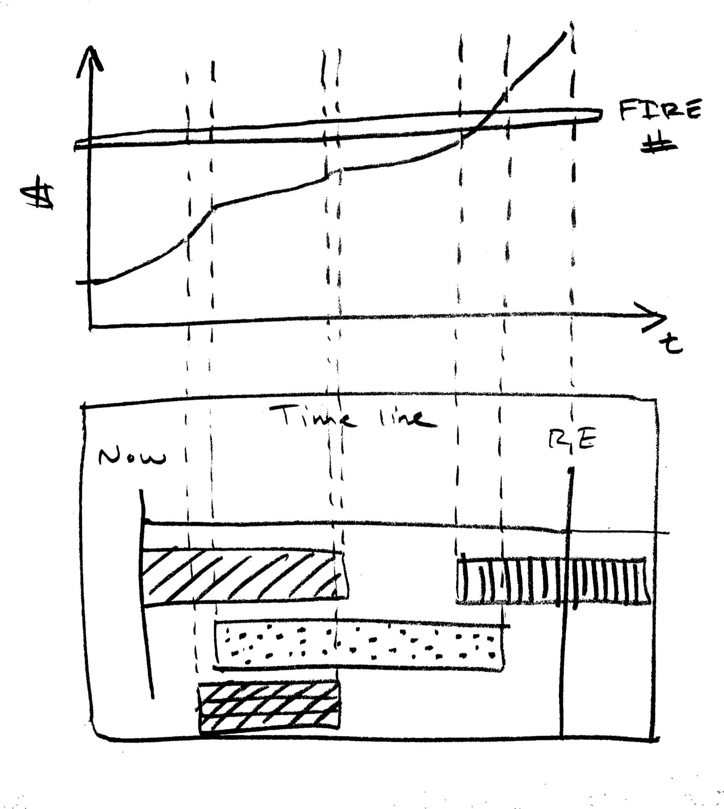
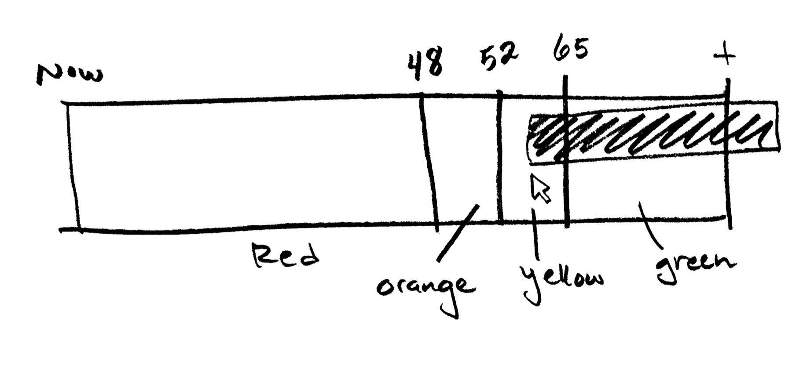

# coast-fire-calculator

The goal of this coast FIRE calculator is to be simplistic, uncluttered, and easy to use (and look at). There are many great calculators out there that are much more capable. In my opinion, [this guy](https://walletburst.com/tools/) has the best FIRE calculators on the Internet. My goal is to have something quick and dirty to do some napkin math while slapping a slider onto (almost) all of the parameters I care about. 

`coast-fire-calculator` is a small CRA that attempts to calculate a coast FIRE number and date based on:

* FIRE number
* current age
* retirement age
* APR
* monthly contributions

## To run

Run this by:

```
npm i
npm run start
```

Then open [http://localhost:3000](http://localhost:3000) to view it in the browser.

Run basic tests to verify coast fire calculations:

```
npm run test
```

## Roughly how it works

* Slap a bunch of bootstrap for sliders and toggles
* Indicate interest vs. principal and division between coast FIRE accumulation and non-accumulation phase with `chart.js`
* Iteratively dial onto the coast FIRE number (because I didn't do the real math)

## Goals/Ideas

There are a few potentially useful presentations of coast FIRE calculations:

* No graph: punch in some data and get a coast FIRE number, date, and age.
* Graph: have a bunch of sliders, knobs, inputs, and automatically repaint a graph/timeline illustrating asset appreciation
* Experimental timeline
    * Offer a UI that allows users to flesh out a 'timeline' (with a look and feel like an iMovie reel)
    * Fill up the timeline with windows of incomes (or loans like 30 year mortgages or car loans)
        * E.g. Bob contributes $1500/mo for 8 years, and then contributes $400 at a part-time job for the next 12 years, while paying off a 30 year mortgage, and Sally will be able to contribute $2000/mo after she finishes her law degree (but needs to pay off $40K in student loans from X date to Y date)
    * Show graph of value over time, above timeline
* Retirement spectrum: show a red to green spectrum of possible retirement ages
    * Red: impossible retirement (too early of an age)
    * Orange to Yellow: varying levels of income
    * Green: comfortable retirement
    * Hover cursor over areas to see info of retirement at that particular age (like withdrawal income)
    
Right now the calculator only *gives* you a coast FIRE number and date based on your desired retirement age and current rate of contribution. I.e. "how long do you have to keep things up until you hit coast FIRE?" It gives you a basic plan on how to get there. The next step would be to create a UI to allow people to trouble-shoot their own plans ("bring your own plan").





## Motivation

My main motivation is to show the power of investing in your 20s. Coast FIRE is especially useful for young high-income earners. An ideal scenario would be:

* All gas / no brakes approach toward savings in 20s
    * Max out all tax-advantaged savings (no exceptions) and top off a little extra in a taxable brokerage
* Early 30s one can completely halt contributions
* Let time and compound interest take care of the rest
* Life-max to the fullest by dumping every conceivable dollar into housing, travel, projects etc.
* Retire "early" at age 50 after ~20-25 years of high-octane living

After playing with the calculator, it is increasingly clear that shooting for a closer retirement date has diminishing returns. Unless you're earning a super high income, it might be more feasible to sprint toward a coast FIRE number instead. By the time you achieve coast FIRE, you're ready to switch gears and start contributing toward life's major milestones (kids, home, vacations) living like a typical American [HENRY](https://www.investopedia.com/terms/h/high-earners-not-yet-rich-henrys.asp#:~:text=High%20Earners%2C%20Not%20Rich%20Yet%20(HENRYs)%20is%20a%20term,enough%20to%20be%20considered%20rich.) (but also retire comfortably unlike a HENRY).

## Other notes

Icons were generated with:

```
convert -background transparent -define 'icon:auto-resize=16,24,32,64' ./fire-solid.svg favicon.ico
convert -background transparent -resize 192x192 ./fire-solid.svg logo192.png
convert -background transparent -resize 512x512 ./fire-solid.svg logo192.png
```
